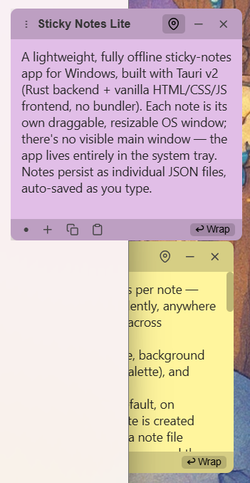
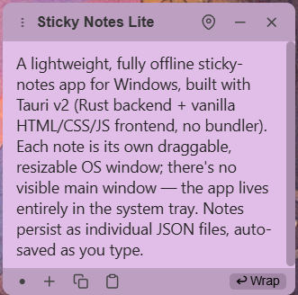
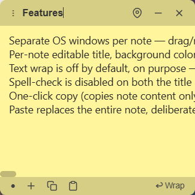
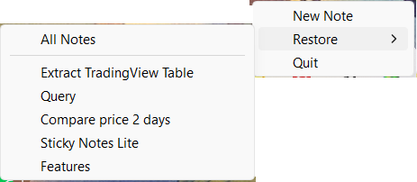

# Sticky Notes Lite

A lightweight, fully offline sticky-notes app for Windows, built with Tauri v2 (Rust backend + vanilla HTML/CSS/JS frontend, no bundler). Each note is its own draggable, resizable OS window; there's no visible main window — the app lives entirely in the system tray. Notes persist as individual JSON files, auto-saved as you type.



## Repository structure

```
README.md                       Overview, features, quick start (this file)
docs/BUILD.md                   Release build internals -- what strip/remap-path-prefix remove and why
docs/CODE_SIGNING.md            Self-signing and Smart App Control notes
docs/ICONS.md                   App icon generation and the Windows icon-cache gotcha
docs/DEVELOPMENT_NOTES.md       Bug history and architectural decisions -- kept in full, not summarized
```

## Features

- Separate OS windows per note — drag/resize independently, anywhere on screen (including across monitors)
- Per-note editable title, background color (fixed 8-color palette), and text-wrap toggle
- **Text wrap is off by default, on purpose** — a new note is created with `wrap: false`, and a note file predating the field is now read the same way (it used to default to `true`, disagreeing with both the intended behaviour and this list). Notes here are usually pasted SQL/logs/paths where wrapping hurts more than it helps; the footer's **Wrap** button turns it on per note and is persisted
- **Spell-check is disabled** on both the title and the body (`spellcheck="false"` in `note.html`). WebView2 ships Chromium's spellchecker and enables it on every editable field by default, which red-underlines most of what actually gets pasted into these notes. There is no per-note toggle — if one is ever wanted it is `el.content.spellcheck = ...`, persisted alongside `wrap`
- One-click **copy** (copies note content only, not the title) and **paste**
- **Paste replaces the entire note, deliberately** — this is the intended behaviour, not an oversight. The button exists to make a note *be* whatever is on the clipboard; ordinary Ctrl+V is still available for inserting at the caret. Two consequences, both accepted: it does not confirm the way Delete does, and because it assigns `el.content.value` directly it also clears the textarea's native undo stack, so Ctrl+Z will not bring the previous content back. Don't "fix" this into an insert-at-caret — that is what Ctrl+V already does
- **Minimize**: hides the note window, and the state is **persisted** — a note minimized when the app closes stays minimized on next launch instead of reappearing on screen. Bring one back from the tray's **Restore** submenu
- **Pin**: keeps a note always on top of every other window (not just other notes) — persisted, so a pinned note reopens pinned
- **New note** button on every note's toolbar (in addition to the tray's "New Note") — a fresh note isn't focused automatically (click into it before typing); this is deliberate, see [`docs/DEVELOPMENT_NOTES.md`](docs/DEVELOPMENT_NOTES.md)
- Delete with an in-page confirmation dialog (not the browser's native `confirm()`, which clips on small windows)
- Auto-save (debounced ~500ms) to `%APPDATA%\com.stickynoteslite.desktop\notes\<uuid>.json`, plus an immediate flush whenever the note stops being editable — losing focus, being hidden/minimized, being closed, or the tray's Quit (see [`docs/DEVELOPMENT_NOTES.md`](docs/DEVELOPMENT_NOTES.md) for how the close/Quit flush works)
- Position/size auto-saved on drag/resize — coalesced in memory and written at most every ~400ms from a background thread, not once per frame — restored on next launch, with a safety clamp so a note can never reopen fully off-screen
- Keyboard: **Ctrl+N** new note, **Esc** closes the color palette or cancels the delete dialog (which opens with *Cancel* focused, so a stray Enter can never delete)
- **Single instance**: launching the exe while it is already running does not start a second copy -- the new process exits and the running one re-shows any note that isn't minimized (deliberately-minimized notes stay hidden)
- No taskbar icon (tray-only); system tray menu: **New Note**, **Restore ▸**, **Quit**. The Restore submenu lists **All Notes** plus one entry per currently-minimized note, labelled by its title (or first non-blank line, or `(empty note)`), so a single note can be brought back without unhiding the rest
- If *every* note is minimized the app legitimately starts with no windows at all — it is tray-resident, and forcing one open would defeat the point of having minimized them
- Quitting via the tray actually exits (as opposed to the Tauri default of quitting whenever the last window closes, which would fight against the tray-resident design)

## Screenshots

<table>
<tr>
<td width="33%"><br>A note window — title bar, toolbar, and footer</td>
<td width="33%"><br>Wrap off by default (the horizontal scrollbar at bottom-left is the tell)</td>
<td width="33%"><br>Tray menu — Restore submenu listing minimized notes</td>
</tr>
</table>

## Project layout

```
src-tauri/           Rust backend
  src/lib.rs           window management, tray, Tauri commands
  src/notes.rs         Note struct + JSON read/write (the data layer)
  tauri.conf.json      no default window (app.windows: []) — windows are all spawned dynamically
  capabilities/        default.json grants note-*  windows the permissions they need
src/                 Frontend (vanilla JS, one template reused per note)
  note.html / note.css / note.js
dist/                The actual exe to run/autostart from (see "Building" below)
```

## Development

```powershell
npm install
npm run tauri dev
```

Every note window loads `note.html?id=<uuid>`, reading the id from the URL query string.

## Building a release exe

```powershell
.\build-release.ps1            # build + sign
.\build-release.ps1 -Deploy    # build + sign + swap into dist\ and relaunch
.\build-release.ps1 -SkipSign  # build only
```

Use the script, not a bare `npm run tauri build`, for anything you actually ship -- a plain build bakes build-machine paths into the binary (see [`docs/BUILD.md`](docs/BUILD.md) for what and why).

A bare `npm run tauri build -- --no-bundle` still works for a throwaway local build (drop `--no-bundle` to also get MSI/NSIS installers, which nothing here uses -- the app runs from `dist\`). `src-tauri\target\` is disposable build cache, can grow to several GB, and is safe to delete -- a fresh build regenerates it from scratch in a few minutes.

Signing your own build (self-signed cert, plus notes on Windows Smart App Control blocking unsigned/self-signed executables): [`docs/CODE_SIGNING.md`](docs/CODE_SIGNING.md).

Changing the app icon: [`docs/ICONS.md`](docs/ICONS.md).

## Data location

Notes live in `%APPDATA%\com.stickynoteslite.desktop\notes\<uuid>.json` — independent of where the `.exe` runs from. Moving/renaming/copying the exe never affects existing notes; only changing `identifier` in `src-tauri\tauri.conf.json` would (don't).

Note JSON schema: `{ id, title, content, color, position: {x,y}, size: {width,height}, wrap, pinned, minimized, created_at, updated_at }` — all in logical (DPI-independent) pixels for position/size. `wrap`, `pinned` and `minimized` all default to `false` when absent from an older file.

`id` is a UUID and doubles as the filename, so `notes.rs` validates it with `Uuid::parse_str` before building any path — a malformed or crafted id can never address a file outside the notes directory.

Writes land in `<uuid>.json.tmp` and are then renamed over the real file, so an interrupted write leaves the previous version intact instead of a truncated one. A note that still fails to parse is skipped by `list_notes()` **and logged to stderr** — it used to disappear from the UI with no trace at all.

Every read-modify-write of a note file goes through one process-wide lock (`NOTE_IO` in `notes.rs`). Content saves arrive on the main thread as IPC commands while geometry is flushed from a background thread, so without it a note dragged during a content save could have the typed text written back from a stale copy. The lock is per-process, and that is sufficient *because* of the single-instance guard (see Features above, and [`docs/DEVELOPMENT_NOTES.md`](docs/DEVELOPMENT_NOTES.md) for the rationale) -- there is only ever one process writing. Don't remove the guard on the assumption `NOTE_IO` covers this; it does not.

## Autostart on login

Drop a shortcut to `dist\sticky-notes-lite.exe` into the Startup folder (`Win+R` → `shell:startup`).

## Further reading

Bug history and architectural decisions, kept in full: [`docs/DEVELOPMENT_NOTES.md`](docs/DEVELOPMENT_NOTES.md).
